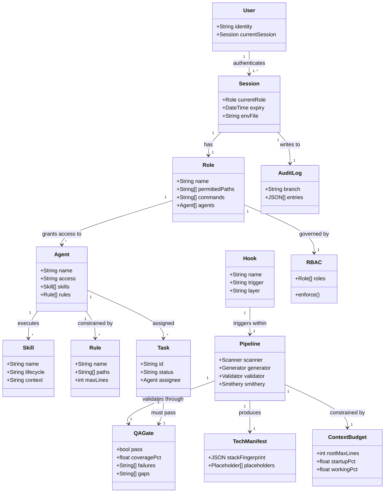

# Domain Model

**Owner:** Architect + Tech Lead
**Last Updated:** 2026-04-01
**Story:** STORY-004
**Source Documents:** docs/GLOSSARY.md, docs/ARCHITECTURE.md, docs/STANDARDS.md, CLAUDE.md

---

## Domain Overview

**Project:** Claude Code Scanner — Codebase Archaeology & Claude Code Environment Generator
**Domain:** AI Development Automation / SDLC Tooling

The system scans existing codebases (or starts from scratch) and generates production-ready Claude Code environments with full software development lifecycle support. It operates on a two-layer architecture: a Root layer (scanner pipeline) that analyzes projects, and a Template layer (generated product) that end users receive. The framework orchestrates 25 role-based agents, 86 workflow skills, 27 hooks, and an enterprise RBAC system to automate the entire path from idea to launch.

---

## Core Entities

| Term | Definition | Source | Confidence |
|------|-----------|--------|------------|
| User | Authenticated person interacting with the system | docs/GLOSSARY.md | HIGH |
| Session | Authenticated user context with expiry; stores CURRENT_ROLE | docs/GLOSSARY.md | HIGH |
| Agent | Claude Code subagent with specific role and tool access (25 total) | docs/GLOSSARY.md | HIGH |
| Skill | Claude Code workflow automation invoked as a slash command (86 total) | docs/GLOSSARY.md | HIGH |
| Hook | Pre/Post tool-use automation script running in its own subprocess (27 total: 9 root + 18 template) | docs/GLOSSARY.md | HIGH |
| Rule | Path-scoped coding rule for Claude Code (8 total) | docs/GLOSSARY.md | HIGH |
| Task | SDLC workflow unit tracked in .claude/tasks/ | docs/GLOSSARY.md | HIGH |
| Role | Enterprise team role (CTO, Architect, Dev, QA, etc.) — 10 roles defined | docs/GLOSSARY.md | HIGH |
| RBAC | Role-Based Access Control — governs who can do what via path-scoped permissions | docs/GLOSSARY.md | HIGH |
| ADR | Architecture Decision Record documenting context, decision, and consequences | docs/GLOSSARY.md | HIGH |
| QA Gate | Quality gate that must pass before PR merge; outputs pass/fail, coverage, failures, gaps | docs/GLOSSARY.md | HIGH |
| Tech Manifest | Output of /scan-codebase — tech stack fingerprint as JSON consumed by Generator | docs/GLOSSARY.md | HIGH |
| Handoff | Structured output block when an agent completes work and transfers context | docs/GLOSSARY.md | HIGH |
| Pipeline | The 4-phase execution sequence: Scan -> Generate -> Validate -> Setup Smithery | CLAUDE.md | HIGH |
| Workflow | A multi-step SDLC process spanning up to 13 phases from idea to launch | CLAUDE.md | HIGH |
| Context Budget | Resource limits governing CLAUDE.md line counts, startup/working context percentages, and MCP server counts | CLAUDE.md | HIGH |
| Drift Detection | Automated checking of CLAUDE.md version and configuration consistency across sessions | docs/ARCHITECTURE.md | HIGH |
| Execution Report | Structured output summarizing what was done during a session or task | CLAUDE.md (hook: execution-report) | MEDIUM |
| Scanner | Stateless service that fingerprints tech stack via 6 parallel agents; reads source files, emits TECH_MANIFEST | docs/ARCHITECTURE.md | HIGH |
| Generator | Service that consumes TECH_MANIFEST and writes all Claude Code artifacts with placeholder substitution | docs/ARCHITECTURE.md | HIGH |
| Validator | Read-only verification service checking generated output quality (line counts, JSON validity, hook permissions) | docs/ARCHITECTURE.md | HIGH |
| Smithery | Network-dependent service that queries MCP registry and installs matching servers | docs/ARCHITECTURE.md | HIGH |
| Hook Runtime | Event-driven execution layer; each hook runs in its own subprocess with scoped env vars, no shared state | docs/ARCHITECTURE.md | HIGH |
| Placeholder | Template variable in `{name}` format resolved from TECH_MANIFEST values during generation | docs/ARCHITECTURE.md | MEDIUM |
| Audit Log | Branch-scoped structured logging for enterprise governance | docs/ARCHITECTURE.md | HIGH |
| Scope Guard | Hook that enforces RBAC path restrictions — blocks writes outside permitted paths | CLAUDE.md (hook: scope-guard) | [INFERRED] MEDIUM |
| Prompt Pipeline | 5-pass scoring system applied to mutating tool calls: specificity, role alignment, domain/GLOSSARY, memory context, risk assessment | CLAUDE.md | HIGH |
| Bounded Context | A logical boundary separating domain concerns (Scanner, Generator, Runtime, RBAC) | docs/ARCHITECTURE.md | [INFERRED] MEDIUM |
| Domain Event | A significant occurrence in the system lifecycle that triggers downstream processing | docs/ARCHITECTURE.md (Data Flow) | [INFERRED] MEDIUM |
| MCP Server | Model Context Protocol server providing tool capabilities to agents | CLAUDE.md | MEDIUM |
| Settings | JSON configuration (settings.json) governing permissions, hooks, and MCP server bindings | docs/ARCHITECTURE.md | HIGH |

---

## Entity Relationships



---

## Bounded Contexts

### 1. Scanner Context
**Responsibility:** Analyze target codebases and produce a Tech Manifest.
**Entities:** Scanner, TechManifest, Placeholder
**Services:** Scanner Service (stateless, read-only on target project)
**Agents:** 6 parallel scanning agents (tech stack, directory structure, backend, frontend, architecture, domain knowledge, tooling)
**Boundary:** No writes to target project. Output is TECH_MANIFEST JSON only.

### 2. Generator Context
**Responsibility:** Transform Tech Manifest into Claude Code environment artifacts.
**Entities:** Generator, Placeholder, Template, Settings
**Services:** Generator Service (consumes TECH_MANIFEST, writes artifacts, no network calls)
**Artifacts Produced:** CLAUDE.md, agents (25), skills (86), hooks (27), rules (8), settings.json, templates, profiles, scripts
**Boundary:** Reads TECH_MANIFEST only. Writes to output directory only. No network dependency.

### 3. Runtime Context
**Responsibility:** Execute the generated environment during development sessions.
**Entities:** Agent, Skill, Hook, Rule, Task, Pipeline, Workflow, Hook Runtime, Context Budget, Prompt Pipeline, Execution Report, Drift Detection, Audit Log
**Services:** Hook Runtime (event-driven, subprocess isolation, scoped env vars)
**Boundary:** Operates within the generated `.claude/` directory. Hooks have no shared state. Context budget enforced per session.

### 4. RBAC Context
**Responsibility:** Enforce role-based access control across all operations.
**Entities:** User, Session, Role, RBAC, Scope Guard, QA Gate
**Services:** Scope Guard Hook, QA Gate validation
**Roles:** CTO, Architect, Tech Lead, Backend Dev, Frontend Dev, Full Stack Dev, QA/SDET, DevOps/Platform, Product Owner/PM, Designer/UX
**Boundary:** Cross-cutting concern. Scope Guard hook intercepts all mutating operations. QA Gate blocks merges until quality criteria met.

---

## Domain Events

| Event | Trigger | Producer | Consumer |
|-------|---------|----------|----------|
| `codebase.scanned` | User runs `/scan-codebase` | Scanner Context | Generator Context |
| `tech_manifest.created` | 6 scanning agents complete and merge results | Scanner Service | Generator Service |
| `environment.generated` | Generator writes all artifacts | Generator Context | Validator Service |
| `environment.validated` | Validator confirms output quality | Validator Service | Smithery Service |
| `smithery.configured` | MCP servers installed for tech stack | Smithery Service | Runtime Context |
| `session.started` | User opens Claude Code session | Runtime Context | Drift Detection, RBAC Context |
| `role.assigned` | User runs `/setup-workspace` | RBAC Context | Scope Guard, all Agents |
| `hook.triggered` | Pre/Post tool-use event fires | Hook Runtime | Target Hook subprocess |
| `drift.detected` | Version mismatch found in CLAUDE.md | Drift Detection | User (warning), `/sync --fix` |
| `qa_gate.evaluated` | PR merge attempted | QA Gate | RBAC Context (allow/block) |
| `task.completed` | Agent finishes assigned work | Agent | Handoff block emitted |
| `prompt.scored` | Mutating tool call intercepted | Prompt Pipeline | Pre-tool-use Hook |
| `audit.logged` | Any governed action occurs | Audit Log | Branch-scoped log file |
| `context.exceeded` | Working context > 60% | Context Budget monitor | User (warning) |

---

## Business Rules

*Source: docs/STANDARDS.md + CLAUDE.md*

1. **Naming — Files:** All files use kebab-case (e.g., `user-service.ts`, `auth-middleware.py`).
2. **Naming — Classes:** PascalCase for all class and type names.
3. **Naming — Functions:** camelCase (JS/TS) or snake_case (Python/Go/Rust).
4. **Naming — Constants:** UPPER_SNAKE_CASE for all constants.
5. **Naming — Database:** snake_case for tables and columns.
6. **Naming — API Routes:** kebab-case plural nouns (e.g., `/api/v1/user-accounts`).
7. **Naming — Glossary Check:** Check GLOSSARY.md before naming any entity, route, event, or variable. Use exact terms. Never synonym.
8. **File Structure:** One export per file for major modules. Group by feature/domain, not by type.
9. **Imports — 5-Tier Order:** (1) Standard library, (2) Third-party, (3) Internal absolute, (4) Internal relative, (5) Type-only imports. Blank line between each group.
10. **Error Handling — Typed Errors:** Use custom error classes extending base Error. Never swallow errors silently.
11. **Error Handling — API Shape:** API errors return consistent `{ error: { code, message, details? } }`.
12. **Error Handling — Boundary Scope:** Use try/catch at service boundaries, not around every line.
13. **Logging — Structured:** Structured JSON in production, human-readable in development. Include timestamp, level, message, service, requestId.
14. **Logging — No PII:** Never log PII, secrets, tokens, passwords.
15. **Testing — AAA Pattern:** Structure all tests as Arrange / Act / Assert.
16. **Testing — Naming:** Test names follow `should [expected behavior] when [condition]`.
17. **Testing — Coverage:** Required: happy path, validation errors, auth errors, edge cases, not-found.
18. **Comments:** No comments for self-documenting code. Comments explain WHY, not WHAT. JSDoc/docstrings for public APIs only.
19. **Commits:** Format `type(scope): description`. Imperative mood, lowercase, no period. Body explains WHY.
20. **Pre-Write Rule:** Before creating any new file/function/class/component: (1) search for existing similar implementation, (2) read /docs/patterns/, (3) check GLOSSARY.md, (4) extend or reuse if similar exists.
21. **Context Budget:** Root CLAUDE.md max 200 lines. Startup context under 20%. Working context under 60%.
22. **RBAC Enforcement:** Never work outside CURRENT_ROLE permitted paths (enforced by scope-guard hook).
23. **QA Gate Required:** All roles must pass QA Gate before PR merge.

---

## Domain Flows

### Flow 1: Codebase Scan to Environment Generation
```
User -> /scan-codebase -> [6 Parallel Agents] -> TECH_MANIFEST
     -> /generate-environment -> [Placeholder Substitution] -> All Artifacts
     -> /validate-setup -> [Line Counts, JSON, Hooks, Budget] -> Pass/Fail
     -> /setup-smithery -> [MCP Registry Query] -> Installed Servers
```

### Flow 2: New Project (Idea to Launch)
```
User -> /new-project "idea"
     -> Brainstorm -> Product Spec -> Feature Map -> Domain Model
     -> Tech Stack -> Architecture -> Scaffold -> Generate Environment
     -> MVP Kickoff -> Feature Dev -> QA Gate -> Launch MVP
```

### Flow 3: Session Lifecycle
```
User opens session -> session-start hook fires
  -> Drift Detection checks CLAUDE.md version
  -> /setup-workspace assigns Role -> session.env written
  -> Scope Guard activated for RBAC enforcement
  -> All tool calls pass through Prompt Pipeline (5-pass scoring)
  -> Agent work produces Handoff blocks
  -> Execution Report generated on session end
```

### Flow 4: Feature Development (Guarded)
```
Dev -> /feature-start "task" -> Branch created, Task assigned
    -> Agent writes code (Scope Guard enforces paths)
    -> Pre-tool-use hook scores each mutation
    -> /feature-done -> QA Gate evaluates
    -> QA Gate pass -> PR merge allowed
    -> QA Gate fail -> Failures + Gaps returned, merge blocked
```
