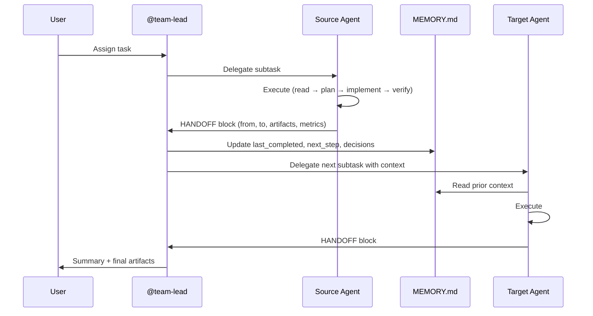

# Process Flow: Agent Handoff

**Source:** CLAUDE.md, .claude/agents/*.md
**Owner:** @analyst | **Story:** STORY-007

---

## Trigger
An agent completes its work and needs to pass context to another agent or back to the user.

## Actors
- **Source Agent** — completes work, produces HANDOFF block
- **Target Agent** — receives context, continues work
- **@team-lead** — orchestrates multi-agent workflows
- **User** — final authority on routing decisions

## Narrative
When an agent completes its assigned task, it produces a HANDOFF block that specifies: who it's handing off to, why, what artifacts were produced, what the next agent needs to know, and execution metrics. The parent (usually @team-lead or user) reads the HANDOFF, updates MEMORY.md, and routes to the next agent. The receiving agent loads context from MEMORY.md and the referenced artifacts, then begins its work.

If a handoff is blocked (target agent unavailable or task unclear), it escalates to the user.

## Flow Diagram

## Decision Points
1. **Route to which agent?** — HANDOFF.to field determines target
2. **Blocked?** — If target unavailable, escalate to user
3. **Context recovery needed?** — If agent lost context, read task file + MEMORY.md

## Business Rules
- BR-001: Every agent output MUST end with a HANDOFF block
- BR-002: Only the parent (team-lead or user) writes to MEMORY.md — agents MUST NOT
- BR-003: HANDOFF includes execution_metrics for quality tracking
- BR-004: HANDOFF includes memory_update suggestion — parent decides whether to apply
- BR-005: Agent MUST include NEXT ACTION line for clear routing
