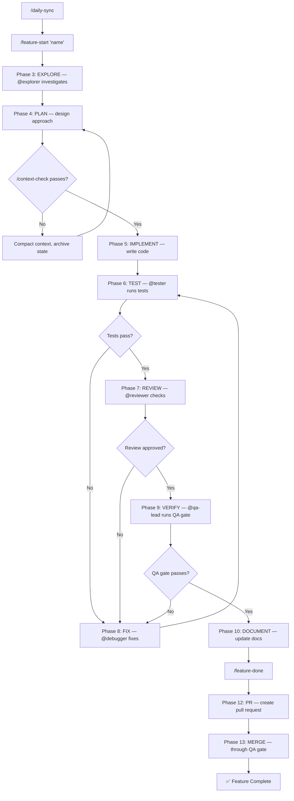

# Process Flow: 13-Phase Feature Workflow

**Source:** CLAUDE.md, README.md, docs/DOMAIN-TEST-GUIDE.md
**Owner:** @analyst | **Story:** STORY-007

---

## Trigger
Developer runs `/feature-start "feature-name"`.

## Actors
- **Developer** — drives the workflow
- **@team-lead** — orchestrates and signs off
- **@tester** — runs tests
- **@reviewer** — performs code review
- **@qa-lead** — approves QA gate

## Narrative
A feature begins with daily sync and a feature-start command that creates a branch, task, and context. The developer explores the codebase, plans the approach, implements changes, writes tests, and requests review. After review feedback is addressed, QA verifies, documentation is updated, and the feature is finalized with a PR and merge through QA gate.

Each phase has an entry condition (previous phase done) and exit condition (quality gate passes). Context is checked between phases to prevent budget exhaustion.

## Flow Diagram

## Decision Points
1. **Context check passes?** — Budget < 60% working limit
2. **Tests pass?** — All unit + integration tests green
3. **Review approved?** — @reviewer signs off on code quality
4. **QA gate passes?** — { pass: bool, coverage_pct, failures[], gaps[] }

## Business Rules
- BR-001: No phase can start until the previous phase's quality gate passes
- BR-002: `/context-check` mandatory between phases
- BR-003: QA gate output includes coverage percentage and failure list
- BR-004: Fix phase loops back to test — cannot skip directly to review
- BR-005: Feature branch follows role-prefix naming convention
