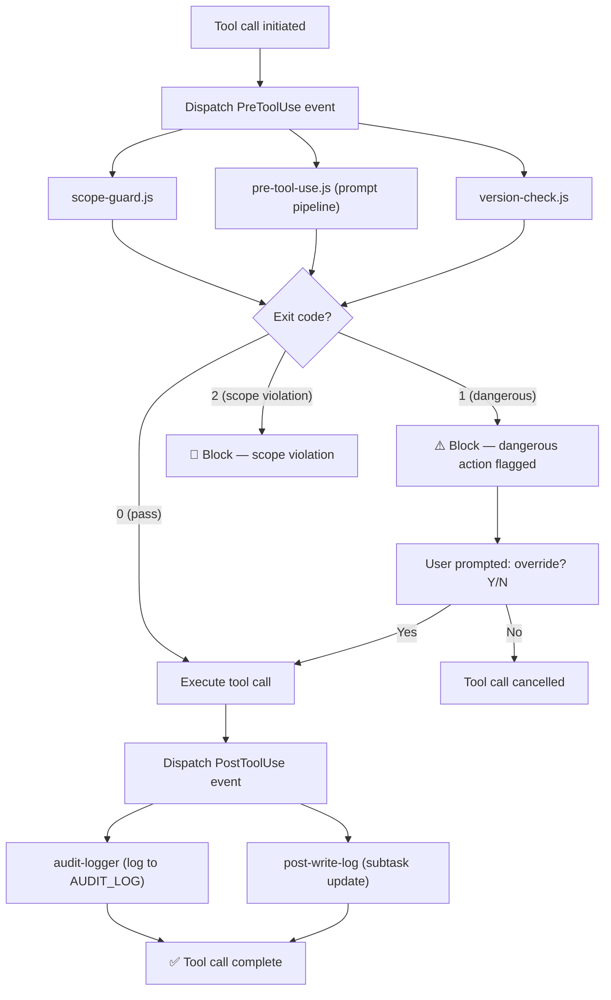

# Process Flow: Hook Event System

**Source:** docs/ARCHITECTURE.md, docs/DOMAIN-TEST-GUIDE.md, CLAUDE.md
**Owner:** @analyst | **Story:** STORY-007

---

## Trigger
Any tool call event in the Claude Code session.

## Actors
- **Claude Code Runtime** — dispatches events
- **Hook Runtime** — executes hook scripts in isolated subprocesses
- **Hook Scripts** — individual .js/.sh scripts that handle events

## Narrative
When a tool call occurs, the Claude Code runtime dispatches events to registered hooks. PreToolUse hooks fire before the tool executes — they can pass (exit 0), block as dangerous (exit 1), or block as scope violation (exit 2). PostToolUse hooks fire after the tool completes and handle logging and state updates. Other events (SessionStart, Stop, PreCompact) fire at session lifecycle points.

Each hook runs in its own isolated subprocess. Hooks cannot share state — they communicate only through files (AUDIT_LOG, session.env, MEMORY.md).

## Flow Diagram

## Decision Points
1. **Exit code?** — Each PreToolUse hook returns 0/1/2
2. **Override?** — User can override dangerous (exit 1) warnings

## Business Rules
- BR-001: Hooks run in isolated subprocesses — no shared state
- BR-002: Exit code 2 (scope violation) cannot be overridden
- BR-003: Exit code 1 (dangerous) prompts user for confirmation
- BR-004: All hook failures are logged, never crash the session
- BR-005: Hook execution timeout: 2 seconds max
