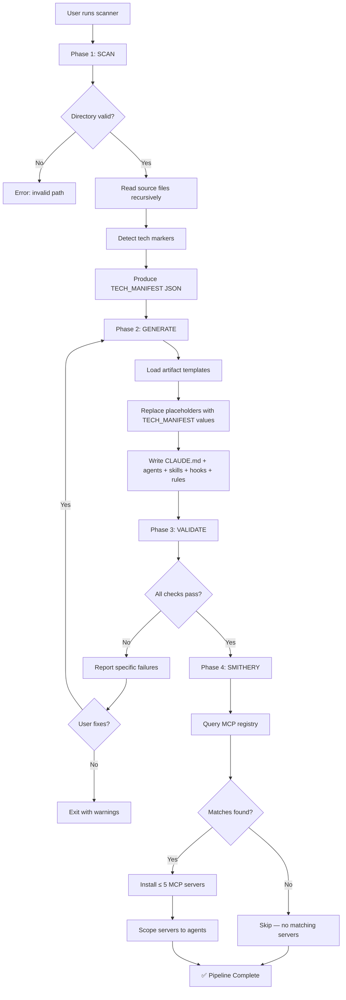

# Process Flow: 4-Phase Pipeline

**Source:** README.md, docs/ARCHITECTURE.md
**Owner:** @analyst | **Story:** STORY-007

---

## Trigger
User runs `npx claude-code-scanner` or `node bin/cli.js` in a project directory.

## Actors
- **User** — initiates the pipeline
- **Scanner Service** — reads source files, detects tech stack
- **Generator Service** — produces Claude Code artifacts
- **Validator Service** — checks artifact quality
- **Smithery Service** — queries MCP registry

## Narrative
The user points the scanner at a codebase. The Scanner reads all source files and produces a TECH_MANIFEST JSON describing the detected technology stack. The Generator consumes this manifest and produces all Claude Code artifacts (CLAUDE.md, agents, skills, hooks, rules) with placeholders replaced by real values. The Validator checks every artifact against constraints (line counts, JSON validity, permissions). Finally, the Smithery service queries the MCP registry for servers matching the tech stack and installs up to 5 scoped servers.

If validation fails, the user is shown specific errors and can re-run the generator with fixes.

## Flow Diagram

## Decision Points
1. **Directory valid?** — Scanner checks path exists and contains readable files
2. **All checks pass?** — Validator runs all constraint checks
3. **Matches found?** — Smithery queries return relevant MCP servers
4. **User fixes?** — User decides to fix and re-run or exit with warnings

## Business Rules
- BR-001: Scanner reads source files but never writes to the target project
- BR-002: Generator consumes TECH_MANIFEST only — no direct file reading
- BR-003: Validator checks are deterministic and idempotent
- BR-004: Maximum 5 MCP servers installed to manage context budget
