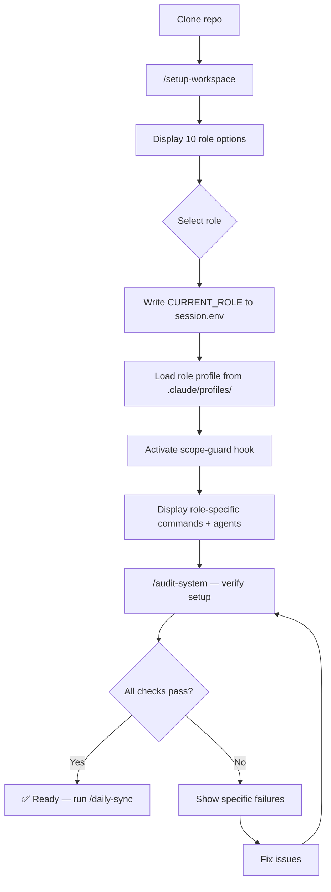

# Process Flow: RBAC Role Setup

**Source:** docs/adr/0001-enterprise-rbac.md, CLAUDE.md, docs/ONBOARDING.md
**Owner:** @analyst | **Story:** STORY-007

---

## Trigger
New team member runs `/setup-workspace` on first session.

## Actors
- **New Team Member** — selects role
- **Scope Guard Hook** — enforces path restrictions
- **Session Manager** — stores role in session.env

## Narrative
A new team member clones the repo and runs `/setup-workspace`. They select from 10 available roles. The system writes `CURRENT_ROLE` to `.claude/session.env`, loads the role-specific profile, and activates the scope-guard hook. From this point, all file operations are filtered through RBAC — writes outside allowed paths are blocked.

## Flow Diagram

## Decision Points
1. **Select role** — User chooses from 10 predefined roles
2. **All checks pass?** — Audit verifies CLAUDE.md, hooks, session.env

## Business Rules
- BR-001: Role stored in session.env — not in memory, not in CLAUDE.md
- BR-002: Role switching requires re-running `/setup-workspace`
- BR-003: CTO role has wildcard path access (`*`)
- BR-004: All other roles have explicit path allowlists
