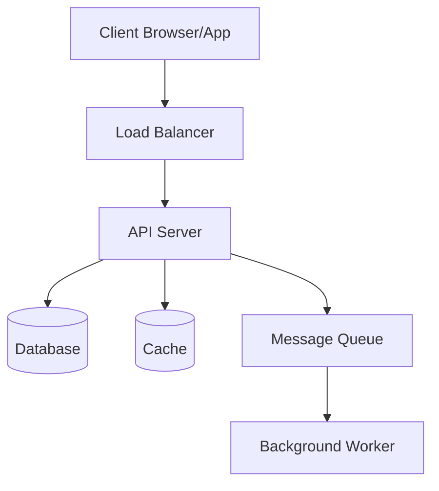
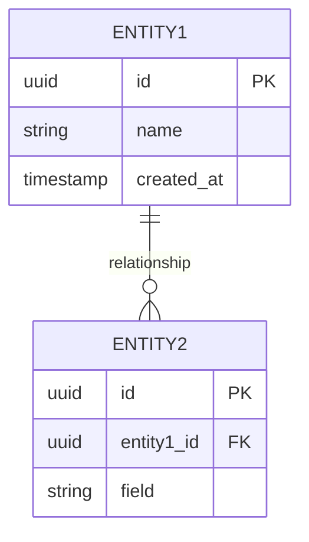
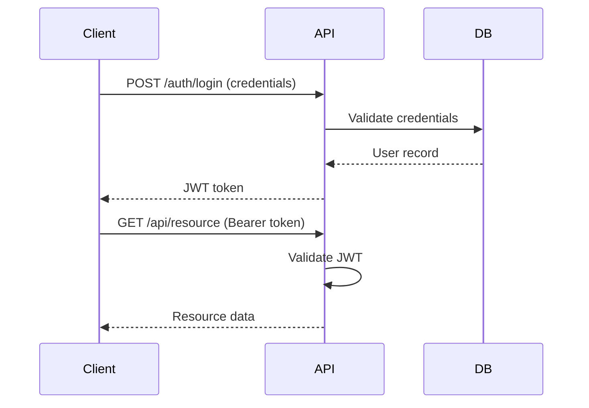

# System Architecture

> Generated by @architect + @ux-designer during Pre-Phase 5: Architecture

## System Overview



{Brief description of the system and how components interact}

## Data Model



## API Design

### Endpoints

| Method | Path | Description | Auth | Request | Response |
|--------|------|-------------|------|---------|----------|
| GET | /api/v1/{resource} | List resources | Yes | query params | array |
| POST | /api/v1/{resource} | Create resource | Yes | body JSON | object |
| GET | /api/v1/{resource}/:id | Get resource | Yes | — | object |
| PUT | /api/v1/{resource}/:id | Update resource | Yes | body JSON | object |
| DELETE | /api/v1/{resource}/:id | Delete resource | Yes | — | 204 |

### Authentication Flow



## Component Hierarchy (Frontend)

```
App
├── Layout
│   ├── Header (nav, auth status)
│   ├── Sidebar (navigation)
│   └── Main Content
│       ├── Page Components
│       │   ├── Dashboard
│       │   ├── List View
│       │   └── Detail View
│       └── Shared Components
│           ├── Form Controls
│           ├── Data Tables
│           └── Modals
└── Providers (Auth, Theme, State)
```

## Directory Structure

```
project-root/
├── src/
│   ├── api/           # Route handlers / controllers
│   ├── services/      # Business logic
│   ├── models/        # Data models / entities
│   ├── middleware/     # Auth, validation, error handling
│   ├── utils/         # Shared utilities
│   ├── config/        # App configuration
│   └── types/         # Type definitions
├── tests/
│   ├── unit/
│   ├── integration/
│   └── e2e/
├── migrations/        # Database migrations
├── scripts/           # Build/deploy scripts
└── docs/              # Project documentation
```

## Key Design Decisions

| Decision | Choice | Rationale | Trade-offs |
|----------|--------|-----------|------------|
| {area} | {decision} | {why} | {what we give up} |

## Security Considerations

- Authentication: {strategy}
- Authorization: {RBAC/ABAC/etc.}
- Data encryption: {at rest / in transit}
- Input validation: {approach}
- Rate limiting: {strategy}

## Scalability Notes

- Expected load: {users/requests}
- Bottlenecks: {identified bottlenecks}
- Scaling strategy: {horizontal/vertical/auto}
