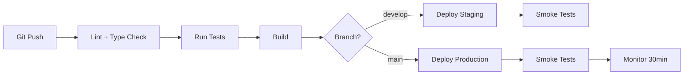

<!-- AUTO-FILLED: This template is populated by /deploy-strategy or @infra agent. Placeholders in {braces} are replaced with project-specific values. Do not manually edit placeholders. -->

# Deployment Strategy

> Generated by @infra during Pre-Phase 8: Launch Planning

## Environments

| Environment | Purpose | URL | Branch | Auto-Deploy |
|-------------|---------|-----|--------|-------------|
| Development | Local dev | localhost:{port} | feature/* | No |
| Staging | Pre-prod testing | staging.{domain} | develop | Yes |
| Production | Live users | {domain} | main | Manual |

## Hosting

| Component | Platform | Region | Tier/Size | Est. Cost |
|-----------|----------|--------|-----------|-----------|
| API Server | {platform} | {region} | {tier} | ${}/mo |
| Database | {platform} | {region} | {tier} | ${}/mo |
| Frontend/CDN | {platform} | Global | {tier} | ${}/mo |
| File Storage | {platform} | {region} | {tier} | ${}/mo |

**Total estimated monthly cost:** ${}/mo

## CI/CD Pipeline

### Pipeline Steps

1. **Lint & Type Check** — {tool}: catch style/type errors
2. **Unit Tests** — {framework}: run full suite, fail on <{threshold}% coverage
3. **Integration Tests** — {framework}: API + DB tests
4. **Build** — {build command}: produce deployable artifact
5. **Deploy** — {method}: blue-green / rolling / canary
6. **Smoke Tests** — {what}: critical path verification
7. **Monitor** — {tool}: watch error rates, latency

## Domain & DNS

| Record | Type | Value | TTL |
|--------|------|-------|-----|
| {domain} | A/CNAME | {target} | 300 |
| api.{domain} | A/CNAME | {target} | 300 |

## Monitoring & Alerting

| Metric | Tool | Alert Threshold | Notify |
|--------|------|-----------------|--------|
| Error rate | {tool} | >1% | {channel} |
| Response time (p95) | {tool} | >500ms | {channel} |
| CPU usage | {tool} | >80% | {channel} |
| Disk usage | {tool} | >85% | {channel} |

## Rollback Plan

1. **Automated:** If health check fails post-deploy, auto-rollback to previous version
2. **Manual:** `{rollback command}` to revert to last known good
3. **Database:** Migrations are forward-only; breaking changes require down migration script

## Security Checklist (Pre-Launch)

- [ ] HTTPS enforced (TLS 1.2+)
- [ ] Environment variables for all secrets (no hardcoded)
- [ ] CORS configured for allowed origins only
- [ ] Rate limiting enabled
- [ ] Security headers set (CSP, HSTS, X-Frame-Options)
- [ ] Dependencies scanned for vulnerabilities
- [ ] Logging configured (no PII in logs)
- [ ] Backup strategy configured and tested

## Launch Checklist

- [ ] All MVP features pass QA
- [ ] Staging environment mirrors production config
- [ ] Database migrations tested on staging
- [ ] Performance benchmarks acceptable
- [ ] Monitoring and alerting configured
- [ ] DNS propagated
- [ ] SSL certificate active
- [ ] Error tracking configured
- [ ] Analytics/telemetry configured
