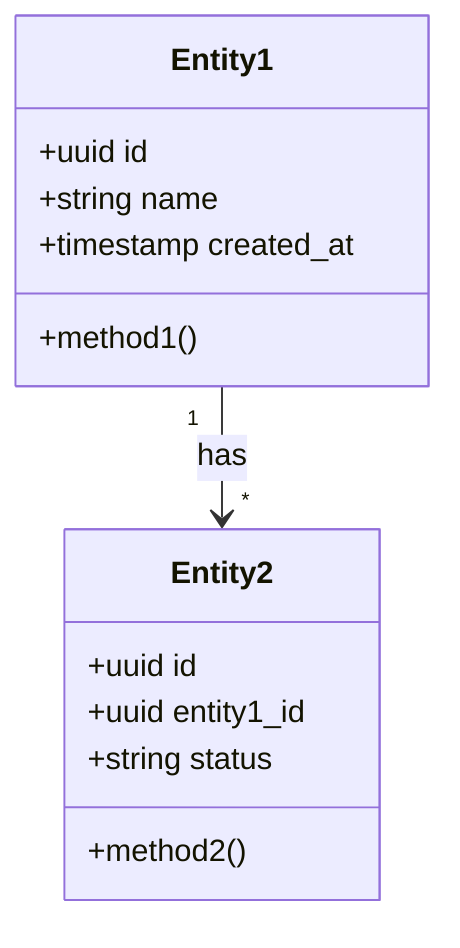
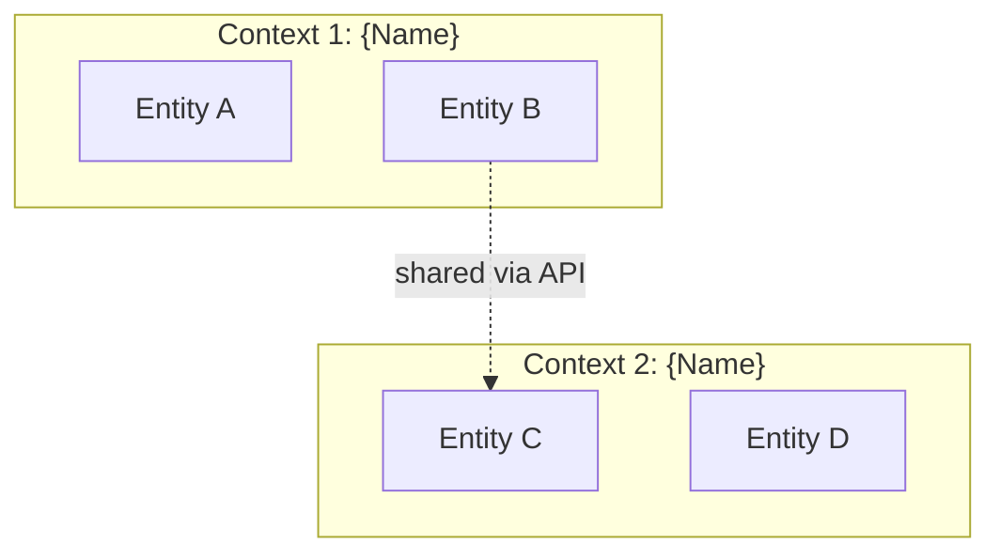
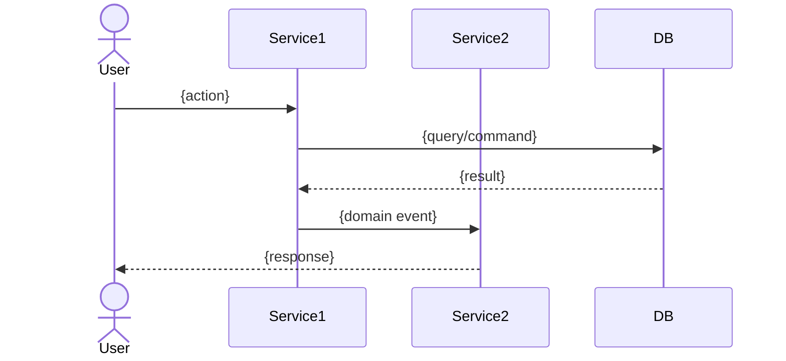

# Domain Model

> Generated by @strategist during domain modeling or extracted from existing documents

## Domain Glossary

| Term | Definition | Context | Aliases |
|------|-----------|---------|---------|
| {term} | {precise definition} | {where it's used} | {other names for same thing} |

## Core Domain Entities

## Entity Details

### {Entity Name}
- **Description:** {what this entity represents in the business domain}
- **Attributes:** {key fields and their meaning}
- **Behaviors:** {what actions can be performed on/by this entity}
- **Rules:** {business rules that govern this entity}
- **Relationships:** {how it connects to other entities}

## Bounded Contexts

| Context | Entities | Responsibility | Communication |
|---------|----------|----------------|---------------|
| {context} | {entities} | {what it owns} | {how it talks to others} |

## Domain Events

| Event | Trigger | Producer | Consumer(s) | Data |
|-------|---------|----------|-------------|------|
| {event name} | {what causes it} | {source context} | {who listens} | {payload} |

## Business Rules

| # | Rule | Entities | Enforcement | Example |
|---|------|----------|-------------|---------|
| 1 | {rule description} | {affected entities} | {where enforced} | {concrete example} |

## Domain Flows

### Flow: {name}

## Aggregates (if DDD applicable)

| Aggregate Root | Members | Invariants |
|---------------|---------|------------|
| {root entity} | {child entities} | {rules that must always hold} |
