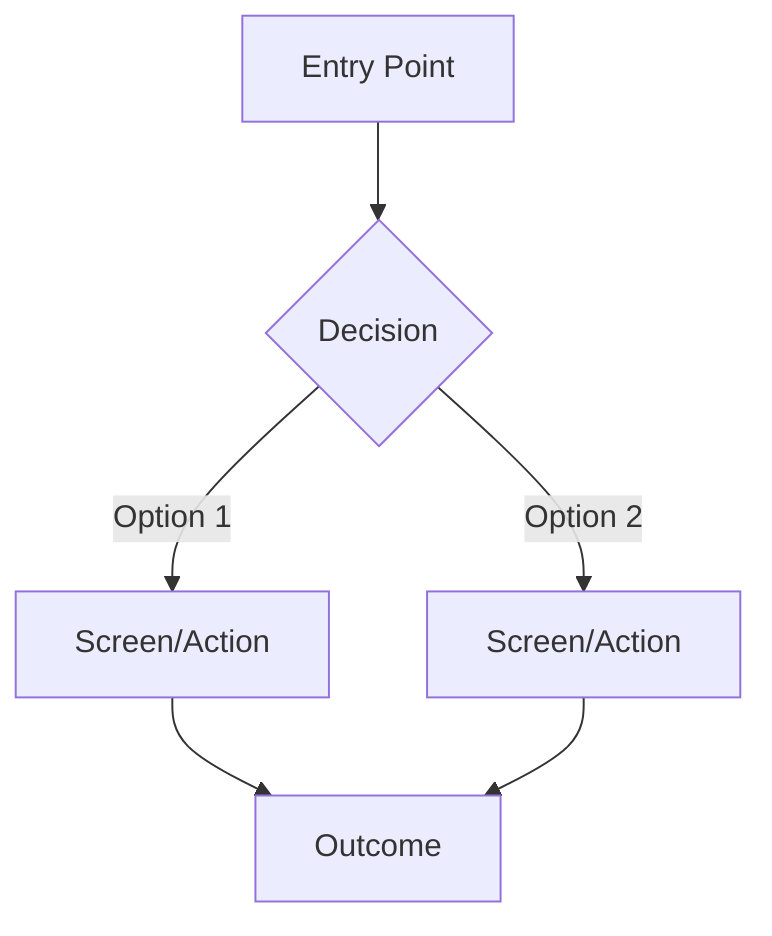

# Product Specification

> Generated by @strategist + @ux-designer during Pre-Phase 2: Product Spec

## Vision

{One paragraph: what does the finished product look like? What impact does it have?}

## MVP Definition

**In scope (MVP):**
1. {core capability}
2. {core capability}

**Out of scope (post-MVP):**
1. {future capability}
2. {future capability}

## User Journeys

### Journey 1: {journey name}

**As a** {user type}, **I want** {goal}, **so that** {benefit}.

**Steps:**
1. User {action}
2. System {response}
3. User {action}
4. System {response}

**Acceptance Criteria:**
- GIVEN {context} WHEN {action} THEN {result}
- GIVEN {context} WHEN {action} THEN {result}

### Journey 2: {journey name}

{Same format as above}

## User Flows

## Success Metrics (KPIs)

| Metric | Target | How to Measure |
|--------|--------|----------------|
| {metric} | {target value} | {measurement method} |

## Constraints

- **Timeline:** {deadline or timeframe}
- **Budget:** {budget constraints}
- **Technical:** {technical limitations}
- **Regulatory:** {compliance requirements}

## Open Questions

1. {question needing resolution}
2. {question needing resolution}
