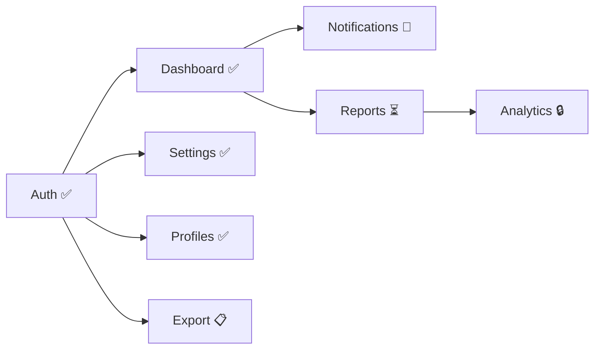

# /mvp-status — MVP Progress Dashboard

## Overview
Unified progress view across the entire MVP. Aggregates backlog status, active workflows,
completed features, quality metrics, and launch readiness into a single dashboard.

## Usage
```
/mvp-status                  # Quick progress summary
/mvp-status --full            # Detailed dashboard with all sections
/mvp-status --deps            # Dependency graph visualization
/mvp-status --quality         # Quality metrics across all features
/mvp-status --launch-ready    # Launch readiness checklist
```

## Dashboard Sections

### Quick Summary (default)
```
## MVP Progress: {project-name}

████████░░░░░░░░ 50% (4/8 features)

| Status | Count | Features |
|--------|-------|----------|
| ✅ Complete | 4 | Auth, Dashboard, Settings, Profiles |
| 🔄 In Progress | 1 | Notifications (Phase 6: DEV_TESTING) |
| ⏳ Ready | 1 | Reports |
| 🔒 Blocked | 1 | Analytics (waiting on Reports) |
| 📋 Pending | 1 | Export |

Next action: /mvp-kickoff next → starts "Reports"
Launch ready: No (4 features remaining)
```

### Full Dashboard (--full)
```
## MVP Dashboard: {project-name}

### Feature Progress
| # | Feature | Size | Status | Task ID | Phase | Quality Score | Duration |
|---|---------|------|--------|---------|-------|---------------|----------|
| 1 | Auth | M | ✅ COMPLETE | TASK-001 | 13/13 | 92/100 | 2 sessions |
| 2 | Dashboard | M | ✅ COMPLETE | TASK-002 | 13/13 | 88/100 | 3 sessions |
| 3 | Settings | S | ✅ COMPLETE | TASK-003 | 13/13 | 95/100 | 1 session |
| 4 | Profiles | S | ✅ COMPLETE | TASK-004 | 13/13 | 90/100 | 1 session |
| 5 | Notifs | M | 🔄 IN_PROGRESS | TASK-005 | 6/13 | — | ongoing |
| 6 | Reports | L | ⏳ READY | — | 0/13 | — | — |
| 7 | Analytics | M | 🔒 BLOCKED | — | 0/13 | — | — |
| 8 | Export | S | 📋 PENDING | — | 0/13 | — | — |

### Aggregate Metrics
- Average quality score: 91.3/100
- Average hallucination score: 0.2/3
- Average regression score: 0.0/3
- Total tests written: 142
- Total test coverage: 84%
- Total bugs found in QA: 3 (all resolved)
- Total deployment rollbacks: 0

### Timeline
| Date | Event |
|------|-------|
| 2026-03-20 | Project created |
| 2026-03-21 | Pre-dev complete (8 phases) |
| 2026-03-22 | Feature 1 (Auth) started |
| 2026-03-23 | Feature 1 (Auth) deployed |
| ... | ... |

### Risks
- Feature 6 (Reports) is L-sized — may need 4+ sessions
- Feature 7 (Analytics) blocked — cannot start until Reports complete
```

### Dependency Graph (--deps)
```
## Feature Dependency Graph



Critical path: Auth → Dashboard → Reports → Analytics (4 features)
Parallel tracks: Settings, Profiles, Export (can run independently)
```

### Quality Metrics (--quality)
```
## Quality Across MVP Features

| Feature | Tests | Coverage | QA Bugs | Review Rounds | Hallucination | Regression |
|---------|-------|----------|---------|---------------|---------------|------------|
| Auth | 42 | 89% | 1 | 1 | 0 | 0 |
| Dashboard | 38 | 82% | 1 | 2 | 0 | 0 |
| Settings | 24 | 91% | 0 | 1 | 0 | 0 |
| Profiles | 28 | 85% | 1 | 1 | 0 | 0 |
| **Total** | **132** | **86%** | **3** | **avg 1.3** | **0** | **0** |

Trend: Quality improving (last 2 features had 0 QA bugs)
```

### Launch Readiness (--launch-ready)
```
## Launch Readiness Checklist

### Features
- [x] All Must-Have features COMPLETE (8/8)
- [ ] All Must-Have features DEPLOYED (7/8 — Export pending deploy)
- [x] No P0/P1 bugs open
- [x] No features with quality score < 70

### Quality
- [x] Average quality score > 80 (current: 91.3)
- [x] No hallucination score >= 2
- [x] No regression score >= 2
- [x] Total test coverage > 75% (current: 86%)

### Integration
- [ ] Cross-feature smoke test passed
- [ ] All API contracts verified
- [ ] Error handling consistent across features
- [ ] Authentication works across all endpoints

### Infrastructure
- [x] CI/CD pipeline green
- [x] Staging environment matches production config
- [ ] Production environment ready
- [ ] DNS configured
- [ ] SSL certificate active
- [ ] Monitoring configured
- [ ] Alerting configured

### Documentation
- [ ] README updated with feature descriptions
- [ ] API documentation complete
- [ ] User guide / onboarding flow

RESULT: NOT READY (5 items pending)
Next: Fix pending items, then run /launch-mvp
```

## Data Sources

| Data | Source | How Read |
|------|--------|----------|
| Feature list & status | `.claude/project/BACKLOG.md` | Parse Must-Have table |
| Feature task IDs | `.claude/project/PROJECT.md` | Features In Development table |
| Task phase & status | `.claude/tasks/TASK-{id}.md` | Read frontmatter |
| Quality scores | `.claude/reports/executions/TASK-{id}_final.md` | Read execution reports |
| Test counts | TASK-{id}.md Phase 6 details | Parse test results |
| Dependencies | `.claude/project/BACKLOG.md` | Parse Dependencies column |
| Deploy strategy | `.claude/project/DEPLOY_STRATEGY.md` | Launch checklist section |

## Outputs
- Dashboard text output (displayed to user)
- No files modified (read-only skill)
